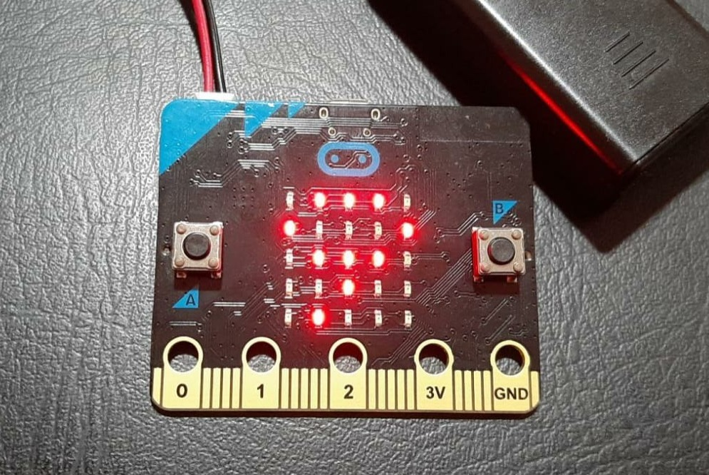

# BBC micro:bit 101 Timer ⏲

## Description

The project is created by BBC micro:bit, it is times and it counts seconds from 0 


> Button a : Start time
> Button b : Stop and start from 0

## The Code Source

1- as we are coding with python we need to import a libary which will help us to use all the functions for coding the micro:bit

```python
from microbit import *
```

2- Adabt some parameters (variables)

```python
time = 0
running = False
```

3- If we press the button "a" the left button the first press will run the timer and the second press will pause the timer and the third press will run it again; if the time is running stop it ! if not start it !

```python
if button_a.was_pressed():
   
        if running:
            running = False
      
        else:
            running = True
```

4- If we press the button "b" the right button, it will set the timer at the value of 0; if it is running or not

```python
 if button_b.was_pressed():

        if running:
            time = 0

        else:
            time = 0
```

5- Increasing the time while is running

```python
 if running:
        time += 1
```

6-Show the tim in the LED matrics in the BBC micro:bit

```python
 display.show(str(time))
    sleep(1000)
```
## Notes 📌

The project will help to master the if else conditions, the project is 101 

🟢 Demo



🟡Using

